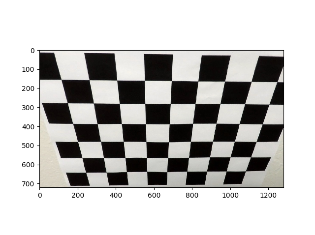
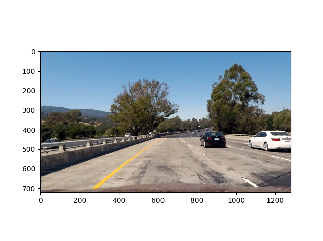
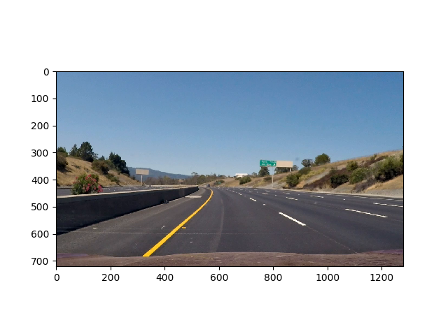
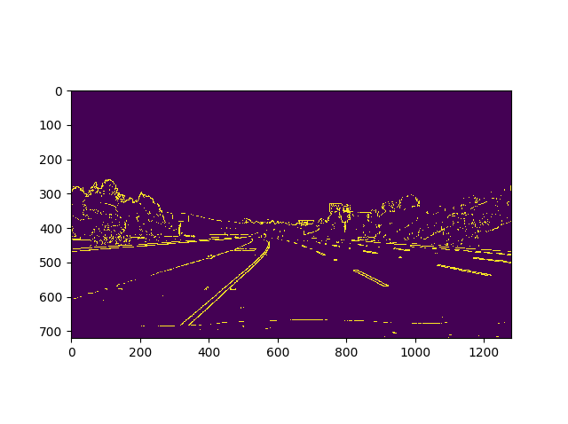
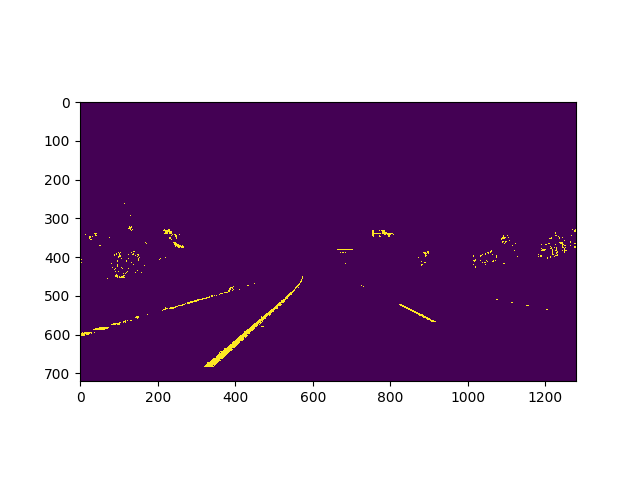
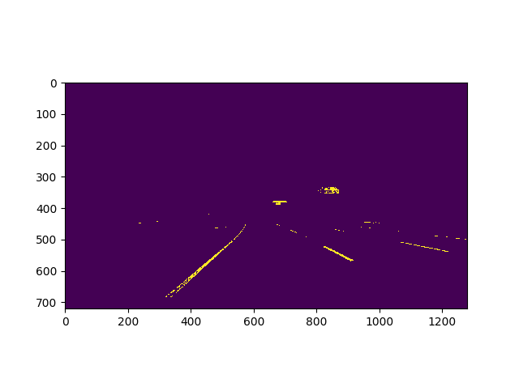
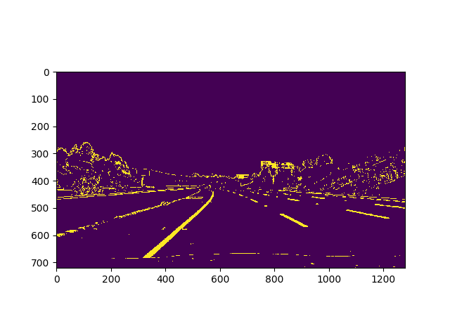
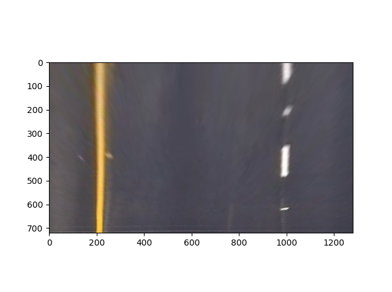
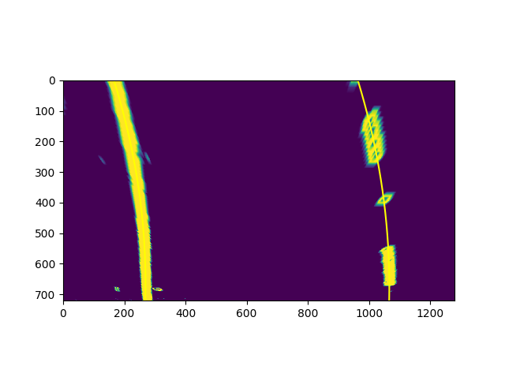
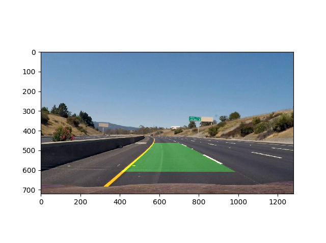

# **Advanced Lane Finding** 
### Self-Driving Car Engineer Nanodegree - _Project 4_
### By: **Soroush Arghavan**

---

The goals / steps of this project are the following:

* Compute the camera calibration matrix and distortion coefficients given a set of chessboard images.
* Apply a distortion correction to raw images.
* Use color transforms, gradients, etc., to create a thresholded binary image.
* Apply a perspective transform to rectify binary image ("birds-eye view").
* Detect lane pixels and fit to find the lane boundary.
* Determine the curvature of the lane and vehicle position with respect to center.
* Warp the detected lane boundaries back onto the original image.
* Output visual display of the lane boundaries and numerical estimation of lane curvature and vehicle position.

[//]: # (Image References)

[video1]: ./output.mp4 "Video"
---

### Submitted Code
The pipleline used for processing each frame is included in pipeline.py which also includes the script to feed the video into the pipeline.

The file helper.py includes all the function definitions used in the project.

The file objects.py includes the defined object classes (Line object).

### Camera Calibration

#### 1. Briefly state how you computed the camera matrix and distortion coefficients. Provide an example of a distortion corrected calibration image.

The code for this step can be found under the calibrate_camera function. First the object points are defined. Then each of the calibration images are loaded and using openCV, the chessboard corners are found (image points). The image points and corresponding object points are then used as arguments for the calibrateCamera function of openCV in order to get the distortion matrix.

The distorsion arguments are then used in conjunction with undistort function of openCV in order to undistort the images. A sample undistorted image is shown below:

 

### Pipeline (single images)

#### 1. Provide an example of a distortion-corrected image.
Below is an example of an undistorted image using the calibration data from previous step.

#### 2. Describe how (and identify where in your code) you used color transforms, gradients or other methods to create a thresholded binary image.  Provide an example of a binary image result.
The first step in process_image function which processes each frame is the sobel gradient calculation. The sobel function uses a combination of sobel magnitude threshhold of between 70 and 255 and directional threshold of 30 to 150 degrees. The resulting "AND" operation between the two is then mixed with the results of a X-direction sobel gradient with the threshold of 40 to 255. A kernel size of 3 was chosen for all gradients.
It should be noted that for obtaining the gradients, the image was converted into grayscale first.

The second filter used was a saturation filter. For this purpose, a HLS filter was used to convert the frame to the HLS color space and then all pixels with a value of above 180 for the S channel were chosen.

Two additional filters were chosen. A grayscale threshold and a red channel threshold were also considered for this purpose since lanes are mostly white, yellow and orange and therefore, red is a common color that can be associated with all of them. The superimposed result of these two filters is shown below:

The combined result is shown here.

#### 3. Describe how (and identify where in your code) you performed a perspective transform and provide an example of a transformed image.

The code for my perspective transform includes a function called `unwarp()`. The function takes as inputs an image (`img`), as well as source (`src`) and destination (`dst`) points.  I chose the hardcode the source and destination points in the following manner by finding the pixels for the lanes on a trapezoid and trial and error to find the best pixels:

| Source        | Destination   | 
|:-------------:|:-------------:| 
| 575, 463      | 200, 0        | 
| 705, 463      | 1000, 0       |
| 1030, 666     | 1000, 768     |
| 275, 666      | 200, 768      |

I verified that my perspective transform was working as expected by drawing the `src` and `dst` points onto a test image and its warped counterpart to verify that the lines appear parallel in the warped image.

#### 4. Describe how (and identify where in your code) you identified lane-line pixels and fit their positions with a polynomial?

I used the sliding window method to find the lanes and find the best fit polynomial. In order to do this a funtion called 'find_lanes()' is provided in the helper file. This function takes the perspective transform image and the current position of lines as inputs. For the first frame the current lines are None.
For the first frame, the histogram of the pixels is used as a starting point for the bottom-most window. 9 windows were chosen and the minimum number of pixels for a window to be valid was chosen to be 50.
For the next frames, the position of the previous lines (which are given as inputs) are used to search for points. The fitting function of Numpy.polyfit() is then used to fit a 2nd-degree polynomial to the pixels as shown below.

#### 5. Describe how (and identify where in your code) you calculated the radius of curvature of the lane and the position of the vehicle with respect to center.

I did this using the 'find_curvature' function in helper. This function takes as arguments the lane coordinates on the image and prints the curvature to the output.

Calibration values of 30 meters per 720 pixels in y-direction and 3.7 metes per 700 pixels in x-direction were chosen.

#### 6. Provide an example image of your result plotted back down onto the road such that the lane area is identified clearly.

The lines from the previous step are averaged over 25 frames. The 'update' function of the 'Line' class takes the latest found lines and updates the averages. The averaged lines are then fed into openCV's 'fillpoly' function to draw the lane. The image perspective is then transformed back into the original perspective and drawn on top of the original image.

---

### Pipeline (video)

#### 1. Provide a link to your final video output.  Your pipeline should perform reasonably well on the entire project video (wobbly lines are ok but no catastrophic failures that would cause the car to drive off the road!).

Here's a [link to my video result](./output.mp4)

---

### Discussion

#### 1. Briefly discuss any problems / issues you faced in your implementation of this project.  Where will your pipeline likely fail?  What could you do to make it more robust?

Although the output video is detecting the lanes successfully, the detection in individual frames especially in shadowed regions of the road could be problematic. These frames can be smoothed out using averaging, however, averaging needs to be optimized.

The processing fps is too low for real time processing. Could C++ implementaiton on a dedicated processor help?

The pipeline is prone to error possibly during lane changes of the vehicle and surrounding cars. Moreover, on city streets the quality of the road could result in noisy image and extra lines perpendicular to lanes such as pedestrian crossings will throw off the lanes.

Suggestions for improvement could include:
* Detect and ignore possible erroneous lines based on sudden change in the polynomial constants (EDIT: added to pipeline)
* Adding RGB filtering to the S filter (EDIT: added to pipeline)
* Optimizing Sobel threshold and kernels as well as using y-gradient
* Dynamic source finding for the perspective transform to remove dependency to camera location

